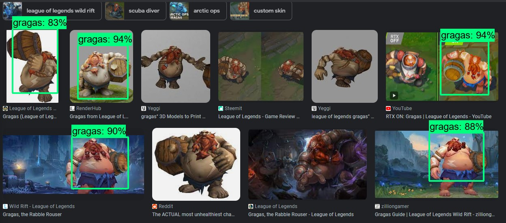
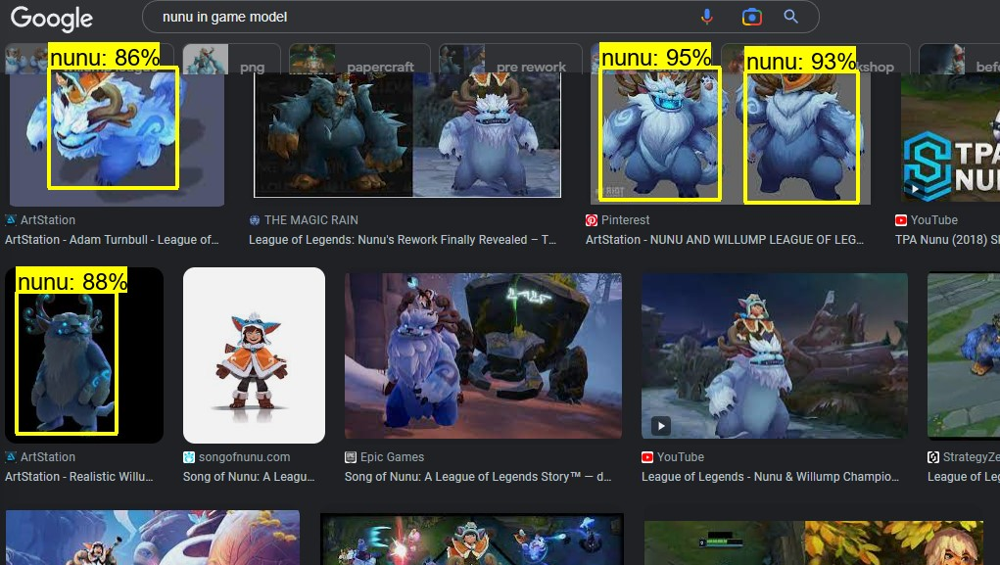

"# bot-gragas league python project\n",
"&nbsp;\n",
"\n",
"This is my object detection project based on Tensorflow. My goal was to create a [League of Legends](https://www.leagueoflegends.com) bot that would automatically recognize characters on the screen and perform voice commands given by the player. The bot is meant to play support champion - Yuumi.\n",
"\n",
"&nbsp;\n",
"\n",
"#### Technologies:\n",
"- [Python 3.10](https://www.python.org/)\n",
"- [Tensorflow 2.10](https://www.tensorflow.org/)\n",
"- [OpenCV](https://opencv.org/)\n",
"- [MSS](https://python-mss.readthedocs.io/)\n",
"- [AutoHotKey](https://pypi.org/project/ahk/)\n",
"- [Numpy](https://numpy.org/)\n",
"- [SpeechRecognition](https://pypi.org/project/SpeechRecognition/)\n",
"\n",
"&nbsp;\n",
"\n",
"#### Simple guide how to use it:\n",
"1. To interact with the program, press the Left Control button\n",
"2. After hearing \"beep\" sound say command (bot listens for 2 seconds)\n",
"3. The finish of recording is again notified by sound signal\n",
"4. To quit program press \"P\" button\n",
"\n",
"&nbsp;\n",
"\n",
"#### Command list (only in Polish):\n",
"- *strzel* + (champion name) - Yuumi casts ***PROWLING PROJECTILE*** in the enemy direction\n",
"- *skocz* + (champion name) - Yuumi jumps on the pointed ally\n",
"- *lecz* + (champion name) - Yuumi heals the  ally which she sits on\n",
"- *super* + (champion name) - Yuumi casts ***FINAL CHAPTER*** in enemy direction\n",
"- *podpal* + (champion name) - Yuumi ignites enemy\n",
"- *zwolnij* + (champion name) - Yuumi uses an exhaust spell on the enemy\n",
"- *kup* + (item name) - Yuumi buys the given item\n",
"- *cofnij* + (item name) - Yuumi undoes the purchase\n",
"\n",
"&nbsp;\n",
"\n",
"#### Important note\n",
"League of Legends client has to be opened in the top left corner, in 1280x720 resolution, windowed! Currently bot is trained for Gragas and Nunu recognition. You can check how it works [here](https://youtu.be/3qUuV_8Iuc4).\n",
"\n",
"&nbsp;\n",
"\n",
"#### Sample recognition\n",
"\n",
"&nbsp;\n",
"\n",
"- ****Gragas****\n",
"\n",
"&nbsp;\n",
"\n",
"\n",
"\n",
"\n",
"&nbsp;\n",
"\n",
"- ****Nunu and Willump****\n",
"\n",
"&nbsp;\n",
"\n",
""
]
